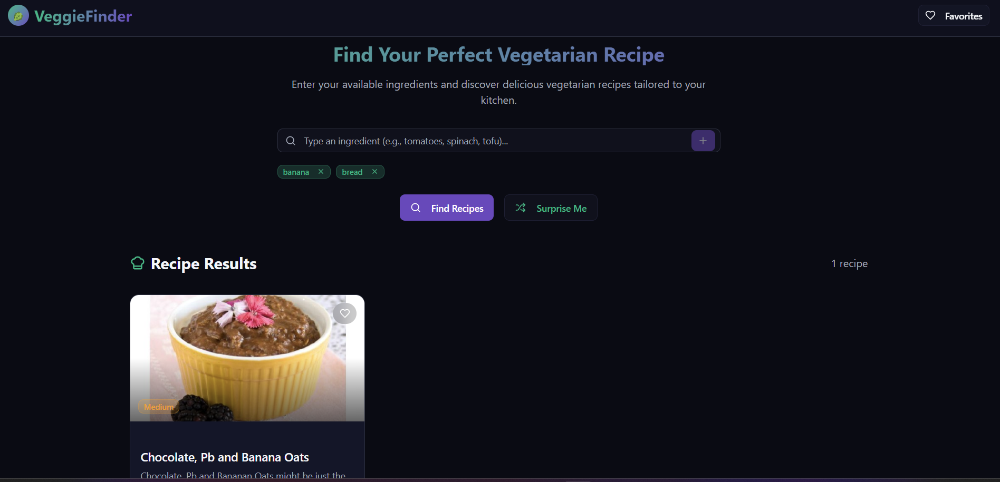

 

  <h1 align="center">Recipe Picker</h1>
  

    Discover delicious recipes tailored to your kitchen ingredients!
     
    <a href="https://recipe-picker-xi.vercel.app/">View Demo</a>
    ·
    <a href="https://github.com/purvii12/recipe-picker/issues">Report Bug</a>
    ·
    <a href="https://github.com/purvii12/recipe-picker/issues">Request Feature</a>
  

---
  
*Screenshot showing the main UI of the project.*
---

##  About The Project

Recipe Picker is a React-based single-page application that lets users search vegetarian recipes by ingredients. It integrates:

- Spoonacular API for recipe data  
- Firebase Authentication for secure Google sign-in  
- Firestore for user favorites saving  

The app features a clean UI, recipe modals with nutrition info, and favorites persistence.

---

## ✨ Features

-  Search recipes by ingredients  
-  Surprise me with a random vegetarian recipe  
-  Mark recipes as favorites and save them securely  
-  Google Authentication with Firebase  
-  Responsive design for all devices  
-  Fast and dynamic UI animations  

---

---

## 🛠 Installation

Follow these steps to run the app locally:
1. Clone the repo
git clone https://github.com/purvii12/recipe-picker.git
cd recipe-picker

2. Install dependencies
npm install
or
yarn

3. Create .env file with your Spoonacular API key and Firebase config:
    VITE_REACT_APP_SPOONACULAR_API_KEY=your_api_key_here

4. Add Firebase config variables as documented

5. Start development server
npm run dev
or
yarn dev

---

##  Usage

- Open the app in your browser  
- Log in with Google account  
- Add ingredients you have and click **Find Recipes**  
- Mark favorites and explore recipe details  

---

##  Tech Stack

| Technology      | Purpose                |
| --------------- | ---------------------- |
|                       | Frontend framework      |
|         | Auth & Firestore backend |
|                     | Recipe data source      |
|   | Styling & responsiveness |
|   | UI animations      |
|                                   | Build tooling           |

---

##  Roadmap

- [x] Basic search by ingredients  
- [x] Random recipe surprise  
- [x] Google Sign-In Authentication  
- [x] Firestore favorites persistence   
- [ ] User recipe submissions  

---
## 🚀 Future Plans  
I'm cooking up some exciting enhancements to make Recipe Picker smarter, healthier, and more personal:  

🥗 Diet & Health Filters – Options for vegan, gluten-free, keto, or high-protein recipes.  
❤️ Personalized Recommendations – AI-based suggestions based on your saved favorites & cooking history.  
🌍 Cultural Cuisines – Filter recipes by global cuisines (Indian, Italian, Mediterranean, etc.).  
👩‍🍳 Community Recipes – Allow users to submit their own recipes and share with others.  
🛒 Smart Pantry Sync – Connect with a virtual pantry tracker to suggest recipes as ingredients run low.  

## 🤝 Contributing

Contributions are always welcome! Please open an issue or submit a PR.

- Fork the repo  
- Create your feature branch (`git checkout -b feature/fix`)  
- Commit your changes (`git commit -m 'Add something'`)  
- Push branch (`git push origin feature/fix`)  
- Open a Pull Request  

---

## 📄 License

This project is licensed under the MIT License - see the [LICENSE](https://github.com/your-username/recipe-picker/blob/main/LICENSE) file for details.

---

##  Contact

Created by https://github.com/purvii12 - feel free to reach out!

---

##  Acknowledgments

- [Spoonacular API](https://spoonacular.com/food-api) for all recipe data  
- [Firebase](https://firebase.google.com/) for easy auth & database  

